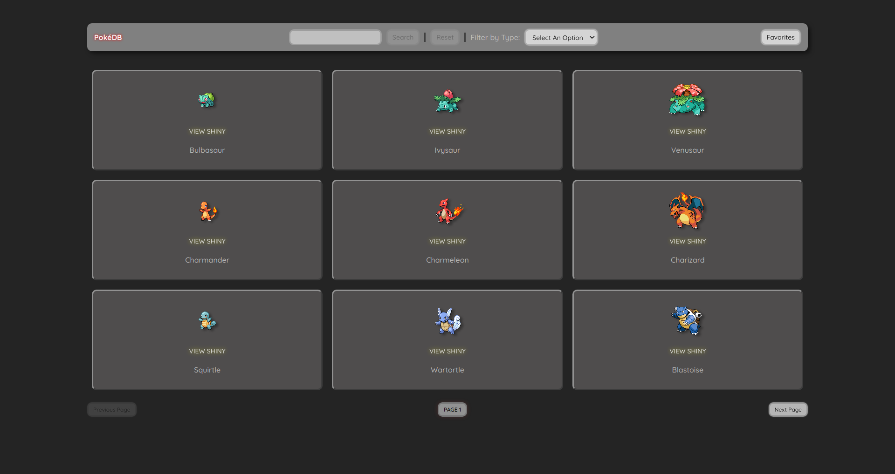
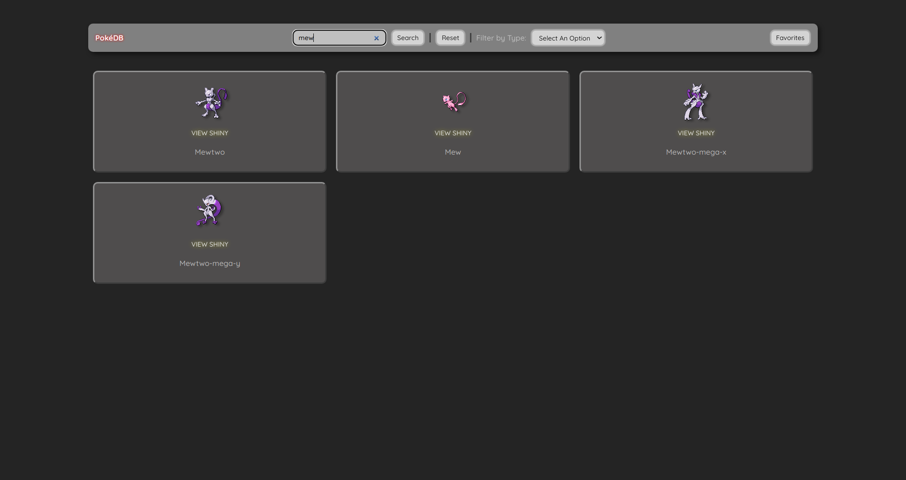
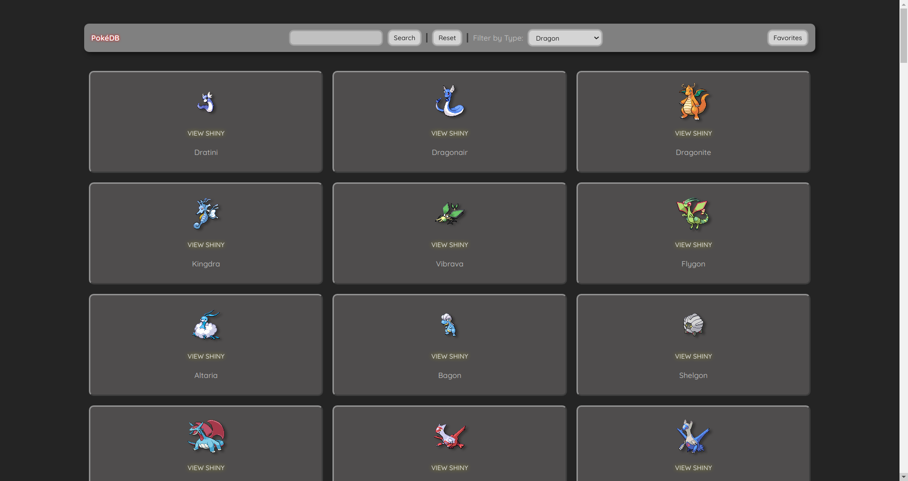
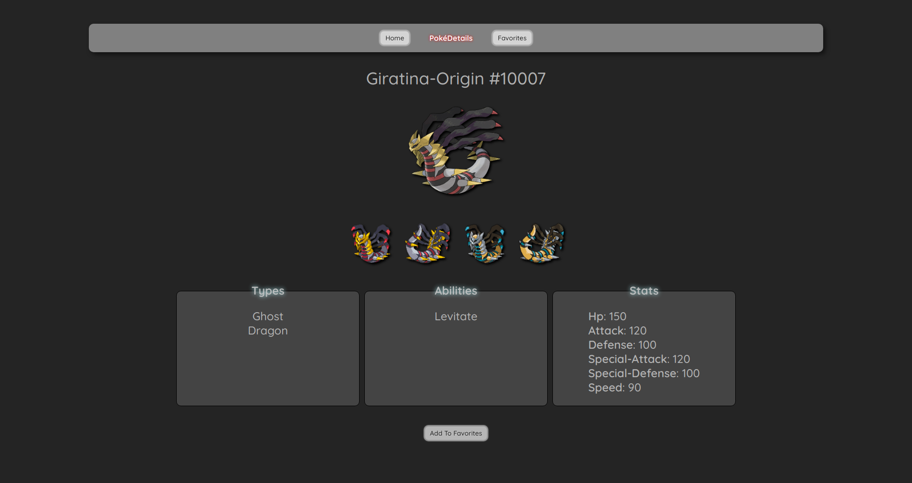
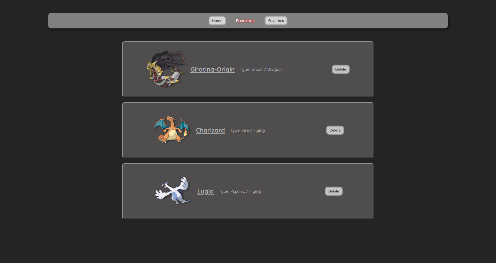

# PokéDB

This app utilizes the PokéAPI and serves as a Pokédex/Pokémon database where users can explore all existing Pokémon by pagination or by searching for a Pokémon by name or filtering by type and access information about each Pokémon if required.
 
Additionally, users are able to compile a list of their favorite Pokémon.

## Screenshots

###### Home

###### Search

###### Filter

###### Details

###### Favorites

## Technologies

This app was built using **HTML, CSS, ReactJS**

## Getting Started

View the demo here: [**PokéDB**](https://p2-poke-db.vercel.app/)
 
View the public board planning here: [**Trello**](https://trello.com/b/LClzgBrw/pokeapi-app)

## Next Steps

- Autocomplete and search suggestions
- More filter options like Pokémon generation
- Color cards based on types
- Create and edit different lists of Pokémon

## Challenges

One major challenge was trying to handle the fetching of data when using the filter function as there were a lot of Pokémon, which caused many performance and network issues. 
 
Another challenge was trying to change the URL while staying on the same page while displaying new content when doing pagination, searching, or filtering.

## Key Takeaways

One key learning was learning how to efficiently fetch data from multiple endpoints using Promise.all, which significantly improved the performance of the app. 
 
I also learned how to implement client-side routing to update my URL and update the page content without going to another page. This enables users to share the link of the current page and view its content.
